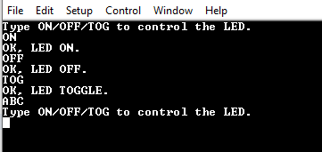
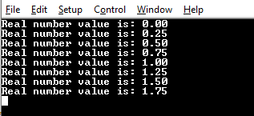
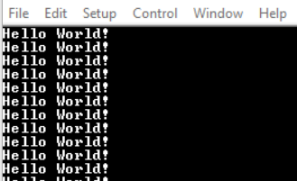
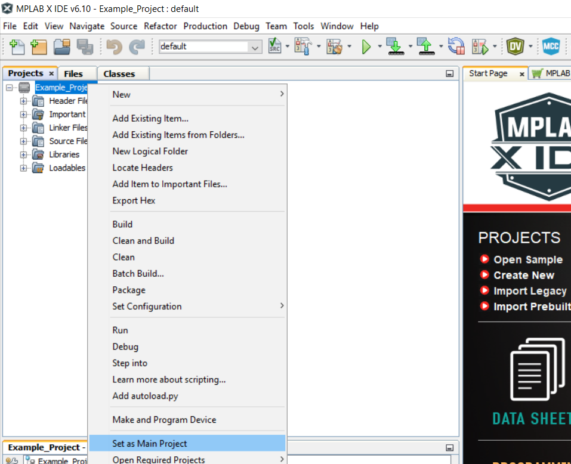
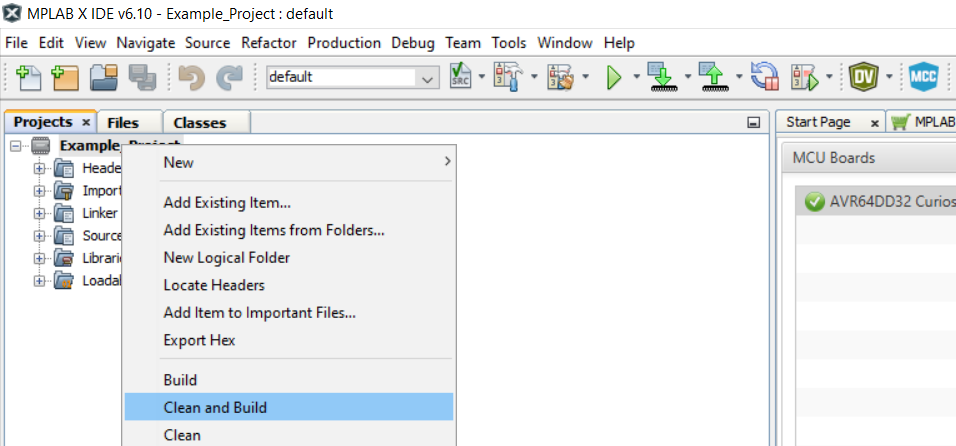
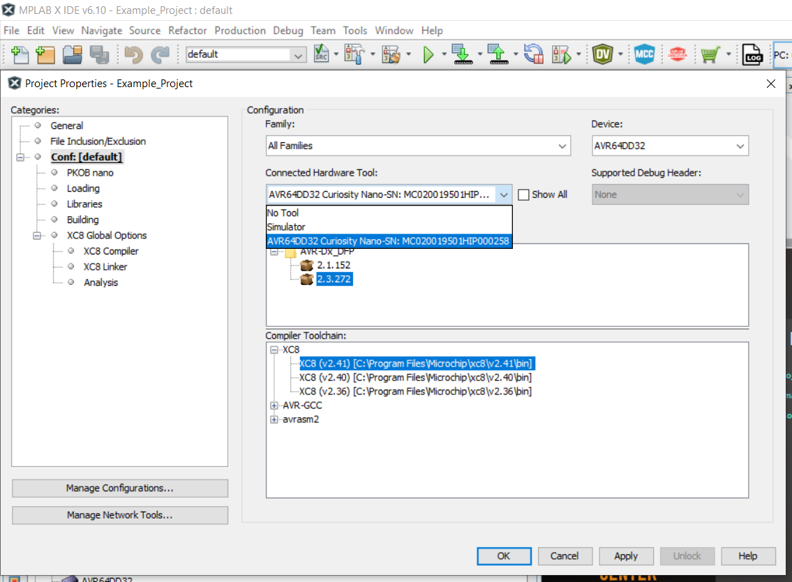
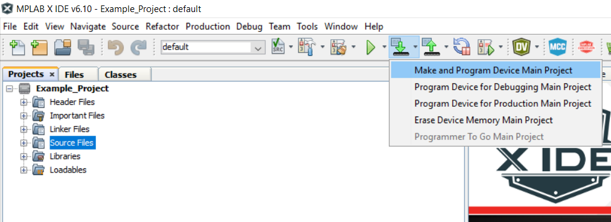

<!-- Please do not change this html logo with link -->

# Getting Started with USART Using the AVR64DD32 Microcontroller using MCC Melody

 The repository contains three MPLAB® X projects:

1.  [Receive Control Commands](#1-receive-control-commands) – This code example demonstrates how to send formatted messages through USART using `printf`.
2.  [Send Formatted String using printf](#2-send-formatted-strings-using-printf) This example code shows how to use USART to allow the microcontroller to receive commands via command-line.
3.  [Send Hello World](#3-send-hello-world) – This code example shows how to send the string `Hello world!\n\r` through the USART peripheral.

## Related Documentation

More details and code examples on the AVR64DD32 can be found at the following links:

- [AVR64DD32 Product Page](https://www.microchip.com/wwwproducts/en/AVR64DD32)
- [AVR64DD32 Code Examples on GitHub](https://github.com/microchip-pic-avr-examples?q=AVR64DD32)
- [AVR64DD32 Project Examples in START](https://start.atmel.com/#examples/AVR64DD32CuriosityNano)

## Software Used

- [MPLAB X IDE](http://www.microchip.com/mplab/mplab-x-ide) v6.10 or newer
- [MPLAB XC8](http://www.microchip.com/mplab/compilers) v2.41 or newer
- [AVR-Dx Series Device Pack](https://packs.download.microchip.com/) v2.3.272 or newer
- [MPLAB Code Configurator Melody](https://www.microchip.com/en-us/tools-resources/configure/mplab-code-configurator/melody) v2.5.0 or newer
- AVR Devices Library v4.7.0 or newer

## Hardware Used

- Logic Analyzer
- The [AVR64DD32 Curiosity Nano Development Board](https://www.microchip.com/en-us/development-tool/EV72Y42A) is used as a test platform
   

## Operation

To program the Curiosity Nano board with this MPLAB X project, follow the steps provided in the [How to Program the Curiosity Nano Board](#how-to-program-the-curiosity-nano-board) chapter.  

## 1. Receive Control Commands

This project shows how to use USART to implement a command-line interface. This way, the microcontroller can receive control commands via USART. It is recommended to use the line terminator `\n\r` as a command delimiter for the USART to read complete lines. The application can decode:

- the `ON` command, and it will turn on the LED and reply with `OK, LED ON.\n\r`
- the `OFF` command, and it will turn off the LED and reply with `OK, LED OFF.\n\r`
- the `TOG` command, and it will toggle the LED and reply with `OK, LED TOGGLE.\n\r`
- for any other command, it will reply with `Type ON/OFF/TOG to control the LED.\n\r`

### 1.1 Setup

The following configurations must be made for this project:

- Clock frequency set to 4 MHz
- USART0:
	- 115200 baud rate
	- 8 data bits
	- no parity bit
	- 1 stop bit
	- RX and TX pins enabled (PD4 and PD5)

 | Pin                     | Configuration      |
 | :---------------------: | :----------------: |
 |            PD4  (TX)    |   Digital output   |
 |            PD5  (RX)    |   Digital input    |
 |            PF5  (LED)   |   Digital output   |

### 1.2 Demo

**Note**: Open the terminal before programming the device. The help command `Type ON/OFF/TOG to control the LED.` will be received.

 

In this demo, commands are sent via serial communication and a terminal receives the confirmation messages.
 Right after the initialization, the board sends the `Type ON/OFF/TOG to control the LED.` message. Then, it follows the behavior detailed in the description of this README.

### 1.3 Summary

This project shows how to use the USART peripheral to implement a command-line interface.

[Back to top](#getting-started-with-usart-using-the-avr64dd32-microcontroller-using-mcc-melody) 

## 2. Send Formatted Strings Using `printf`

This example demonstrates how to send formatted messages through USART using `printf`. It sends the value of a floating-point counter every 500 ms as a message and then increases the counter.

### 2.1 Setup

The following configurations must be made for this project: 

- Clock frequency set to 4 MHz
- USART0 configuration:
	- 115200 baud rate
	- 8 data bits
	- no parity bit
	- 1 stop bit
	- TX pin enabled (PD4)
	- Redirect Printf to UART - enable

 | Pin                     | Configuration      |
 | :---------------------: | :----------------: |
 |      PD4 (USART0 TX)    |   Digital output   |

### 2.2 Demo

 

In this demo, the value of an increasing floating-point counter is transmitted in the form of `Real number value is: <counter_value>\n\r`.

### 2.3 Summary

This project shows how to use the Universal Synchronous/Asynchronous Receiver/Transmitter (USART) peripheral to send formatted strings.

[Back to top](#getting-started-with-usart-using-the-avr64dd32-microcontroller-using-mcc-melody) 

## 3. Send 'Hello World!'

This project shows how to send the string `Hello world!\n\r` through the USART peripheral every 1000 ms.

### 3.1 Setup

The following configurations must be made for this project:

- System clock configured at 4 MHz
- USART0:
	- 115200 baud rate
	- 8 data bits
	- no parity bit
	- 1 stop bit
	- TX pin enabled (PD4)

 | Pin                     | Configuration      |
 | :---------------------: | :----------------: |
 |            PD4          |   Digital output   |

### 3.2 Demo

In this demo, the message `Hello World!` is sent via serial communication every 1000 ms.

 

### 3.3 Summary

This project shows how to send a string via serial communication using the USART peripheral.

[Back to top](#getting-started-with-usart-using-the-avr64dd32-microcontroller-using-mcc-melody) 

## How to Program the Curiosity Nano Board

This chapter shows how to use the MPLAB X IDE to program an AVR® device with an Example_Project.X. This can be applied to any other projects.

- Connect the board to the PC

- Open the Example_Project.X project in MPLAB X IDE

- Set the Example_Project.X project as main project

  - Right click the project in the **Projects** tab and click **Set as Main Project**
     

- Clean and build the Example_Project.X project

  - Right click the **Example_Project.X** project and select **Clean and Build**
     

- Select **AVRxxxxx Curiosity Nano** in the Connected Hardware Tool section of the project settings:

  - Right click the project and click **Properties**
  - Click the arrow under the Connected Hardware Tool
  - Select the **AVRxxxxx Curiosity Nano** (click the **SN**), click **Apply** and then **OK**:
     

- Program the project to the board
  - Right click the project and then **Make and Program Device**
     

 

- [Back to 1. Receive Control Commands](#1-receive-control-commands) 
- [Back to 2. Send Formatted Strings Using Printf](#2-send-formatted-strings-using-printf) 
- [Back to 3. Send Hello World](#3-send-hello-world) 
- [Back to top](#getting-started-with-usart-using-the-avr64dd32-microcontroller-using-mcc-melody) 

